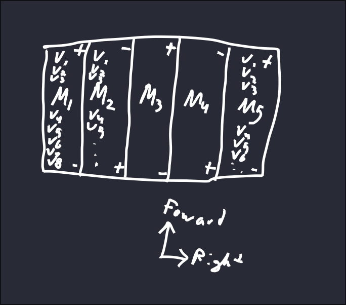

# Setting the target module
## Pre Reqs
All you have to do is have VSCode installed with the platformIO plugin working along with Git, either the GUI or CLI version will be fine

## Steps
1. Clone the repo
2. Open VSCode and open this repos folder
3. Edit main.hpp to whatever target module you want (see CAN_Defs.hpp for all possible IDs)
4. Set forward if the positve is facing forward (see image)

5. Save main.hpp
6. Upload

## Congrats
You should now see your changes reflected on the CAN bus or on the telemetry
